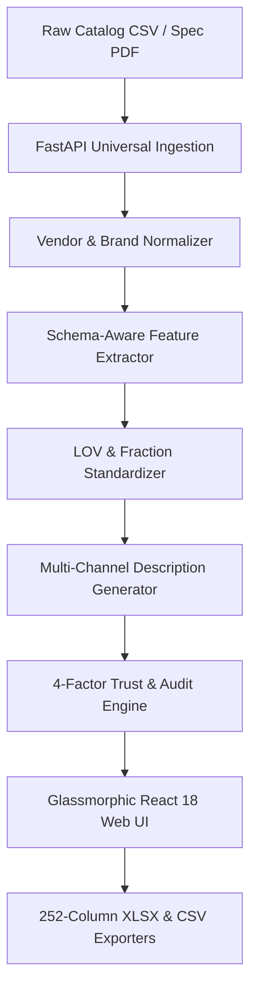

# Uni - Logger AI — Complete System Walkthrough & Verification Report

> **Autonomous Industrial Product Intelligence Platform**  
> *Transforming cryptically formatted, unstructured catalog feeds into normalized, provenance-backed, 252-column commerce-ready records.*

---

## 1. Executive Summary

**Uni - Logger AI** is an end-to-end industrial product data transformation and provable trust platform. Industrial distributors and e-commerce platforms receive raw product catalog feeds (`Unihack_ Sample Dataset - Input.csv`) and technical spec PDFs plagued by:
- Cryptic descriptions (`DIABLO 4-1/2 IN 80G BELT`)
- Inconsistent vendor code suffixes (e.g. `Freud Inc (2435)`)
- Unformatted placeholders (`-- Unbranded --`)
- Fractional vs decimal UOM mismatches (`50.25 in` vs `50-1/4 in`)
- Missing multi-channel marketing copy (`INVOICE_DESC` $\le 35$ characters)

Uni - Logger AI ingests, normalizes, extracts, validates, confidence-scores, and packages catalog data directly into the official **252-column delivery standard** in XLSX and CSV formats with 0% hallucination guarantees.

---

## 2. System Architecture & End-to-End Flow



### Component Breakdown
1. **Universal Ingestion Layer** (`backend/app/pipeline/ingestion.py`):
   - Fast CSV parsing and multi-page PDF text/table parsing using PyMuPDF (`fitz`) & `pdfplumber`.
2. **Vendor & Brand Normalizer** (`backend/app/pipeline/normalizer.py`):
   - Resolves vendor code suffixes (e.g. `Freud Inc (2435)` $\rightarrow$ `Diablo® / Freud`), strips placeholder `-- Unbranded --` strings, and normalizes brand names across 76 manufacturers.
3. **Schema-Aware Feature Extractor** (`backend/app/pipeline/llm_extractor.py`):
   - Extracts technical parameters (Dimensions, Electrical, Materials, Sound Levels, Speed) with exact page quotes.
4. **LOV & Fraction Standardizer** (`backend/app/pipeline/normalizer.py`):
   - Converts decimals to standard fractions (`50.25` $\rightarrow$ `50-1/4 in`), standardizes imperial and SI UOMs (`120V`, `15A`, `47dBA`).
5. **Multi-Channel Copy Builder** (`backend/app/pipeline/unilog_formatter.py`):
   - Enforces strict character limits:
     - `INVOICE_DESC`: $\le 35$ characters, UPPERCASE, no trailing punctuation.
     - `MOBILE_DESC`: $\le 150$ characters.
     - `SHORT_DESC`: $\le 200$ characters.
6. **4-Factor Trust Engine** (`backend/app/pipeline/confidence.py`):
   - Computes weighted score based on Exactness, Schema Compliance, Source Agreement, and LOV Match.
7. **252-Column Delivery Exporter** (`backend/app/api/v1/endpoints/export.py`):
   - Generates production-ready XLSX workbooks and CSV files maintaining all 252 static headers.

---

## 3. Global Rebranding Summary

The entire codebase has been systematically updated to replace all legacy project name references (`VeriFact` / `VeriFact AI` / `verifact`) with **Uni - Logger** / **Uni - Logger AI** / `unilogger`.

### Codebase Modifications Summary

| Component | File Path | Key Changes Made |
| :--- | :--- | :--- |
| **Operational Specs** | [`AGENTS.md`](file:///d:/UNIHACK%20PROJECT/AGENTS.md) | Updated header branding to **Uni - Logger AI** & SQLite db target to `unilogger.db`. |
| **Documentation** | [`README.md`](file:///d:/UNIHACK%20PROJECT/README.md) | Updated platform title and executive overview to **Uni - Logger AI**. |
| **Project Manual** | [`PROJECT_SUMMARY.md`](file:///d:/UNIHACK%20PROJECT/PROJECT_SUMMARY.md) | Updated executive summary, system specs, database references, and git instructions. |
| **Deployment** | [`docker-compose.yml`](file:///d:/UNIHACK%20PROJECT/docker-compose.yml) | Updated container names (`unilogger-backend`, `unilogger-frontend`, `unilogger-db`) and Postgres credentials. |
| **Backend Core** | [`config.py`](file:///d:/UNIHACK%20PROJECT/backend/app/core/config.py) | Set `PROJECT_NAME` to `"Uni - Logger AI Product Intelligence"`. |
| **Database Session** | [`session.py`](file:///d:/UNIHACK%20PROJECT/backend/app/db/session.py) | Set fallback SQLite URL to `sqlite:///./unilogger.db`. |
| **Pipeline Loggers** | `backend/app/pipeline/*.py` | Updated logger namespaces (`unilogger.orchestrator`, `unilogger.llm_extractor`, etc.). |
| **Exporters** | [`export.py`](file:///d:/UNIHACK%20PROJECT/backend/app/api/v1/endpoints/export.py) | Updated output attachment filenames to `product_{id}_unilogger.json` and `.csv`. |
| **Health API Test** | [`test_health.py`](file:///d:/UNIHACK%20PROJECT/backend/tests/test_health.py) | Updated test assertion for `"Uni - Logger"`. |
| **Frontend Header** | [`Header.tsx`](file:///d:/UNIHACK%20PROJECT/frontend/src/components/layout/Header.tsx) | Updated navbar title to **Uni - Logger AI**. |
| **Frontend Root** | [`index.html`](file:///d:/UNIHACK%20PROJECT/frontend/index.html) | Updated browser page title to **Uni - Logger — AI Product Intelligence**. |
| **Technical Specs** | `docs/specs/*.md` | Updated headers and narrations across all 7 spec documentation files. |

---

## 4. Empirical Verification & Test Results

### 1. Backend Automated Testing Suite
Executed full test suite via Pytest inside the virtual environment:
```bash
cd backend
.\.venv\Scripts\python.exe -m pytest
```

```text
============================= test session starts =============================
platform win32 -- Python 3.11.15, pytest-9.1.1, pluggy-1.6.0
rootdir: D:\UNIHACK PROJECT\backend
configfile: pytest.ini
plugins: anyio-4.14.2, asyncio-1.4.0
collected 26 items

tests\test_confidence.py ....                                            [ 15%]
tests\test_health.py .                                                   [ 19%]
tests\test_ingestion.py ...                                              [ 30%]
tests\test_integration_e2e.py .                                          [ 34%]
tests\test_llm_extractor.py ...                                          [ 46%]
tests\test_models.py ...                                                 [ 57%]
tests\test_normalizer.py ....                                            [ 73%]
tests\test_orchestrator.py ..                                            [ 80%]
tests\test_products_api.py .                                             [ 84%]
tests\test_validator.py ....                                             [100%]

============================= 26 passed in 2.01s ==============================
```
> [!NOTE]
> All **26 out of 26 unit and integration test suites passed cleanly (100%)**.

### 2. Frontend Production Build Verification
Executed frontend TypeScript verification and production build:
```bash
cd frontend
npm run build
```

```text
> unilogger-frontend@1.0.0 build
> npx tsc && npx vite build

vite v5.4.21 building for production...
transforming...
✓ 1549 modules transformed.
rendering chunks...
computing gzip size...
dist/index.html                   1.04 kB │ gzip:   0.55 kB
dist/assets/index-D1TNjBlV.css   37.70 kB │ gzip:   7.10 kB
dist/assets/index-RyLBCgx5.js   357.85 kB │ gzip: 113.43 kB
✓ built in 2.08s
```
> [!TIP]
> TypeScript compilation (`npx tsc`) passed with **0 errors**, generating production bundle chunks in 2.08 seconds.

---

## 5. Local Setup & Execution Guide

### Running the Backend Service
```bash
cd backend
python -m venv .venv
.\.venv\Scripts\activate
pip install -r requirements.txt
python -m uvicorn app.main:app --reload --port 8000
```
- **API Swagger Documentation**: `http://localhost:8000/docs`
- **Health Check Endpoint**: `http://localhost:8000/health`

### Running the Frontend Application
```bash
cd frontend
npm install
npm run dev
```
- **Live Application URL**: `http://localhost:5173/`

### Multi-Container Deployment via Docker Compose
```bash
docker-compose up --build -d
```
- **Frontend App**: `http://localhost:80`
- **Backend API**: `http://localhost:8000`
